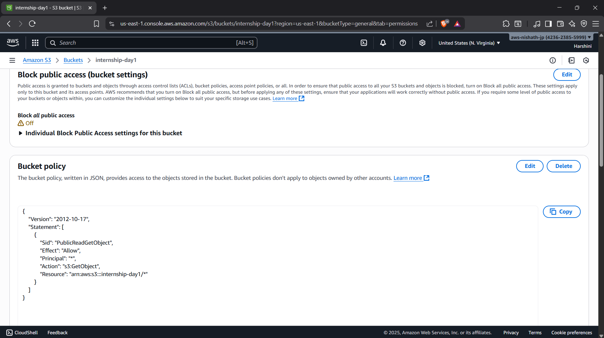

## Task

Today's task is to understand cloud object storage basics.
Tools: Google Cloud Storage (Free Tier) or AWS S3 (Free Tier).

I am going to use AWS s3 to compelete this task.

## What I Did 

- Created a New S3 bucket named internship-day 1.
- And this is a General bucket.

- Then I uploaded my offer letter in the bucket.

- Now my offerletter is has been uploaded in the bucket. 

- To make the bucket public I removed Block all public access and add a new policy to the bucket.

- After I made those changes The bucket and its objects are publicly accessible

- [Click here to view my offer letter](https://internship-day1.s3.us-east-1.amazonaws.com/Harshini+Offer+letter.pdf)
