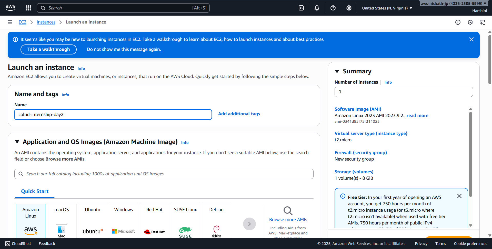
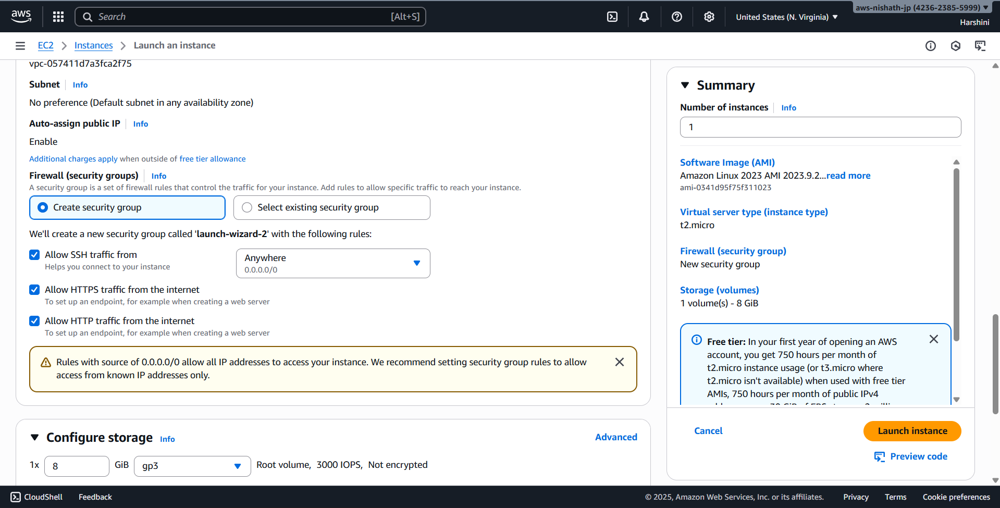
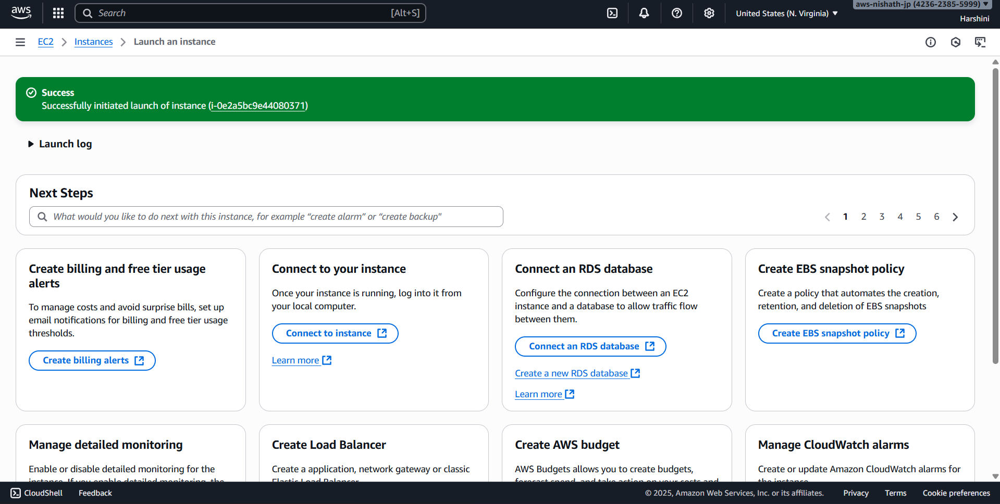
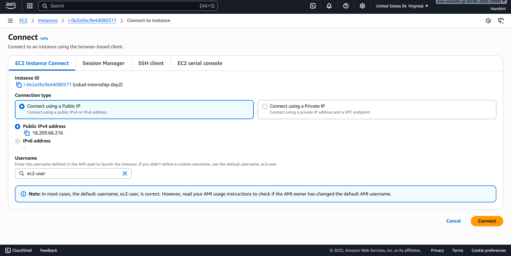
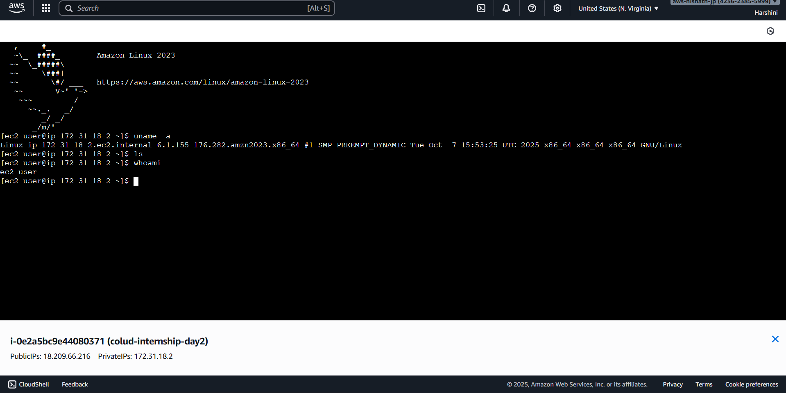

# Day 02

The Day 2 task is to Launch a Virtual Machine (VM) Instance

- I named the EC2 instance has Cloud-internship-day2
- And launched it in the region us-east-1
- I used t2-micro type instance.
  

- Also configured firewall to allow https and http traffic

- Used AWS intance connect to ssh into the Ec2 instance 
- And executed some commends
  

