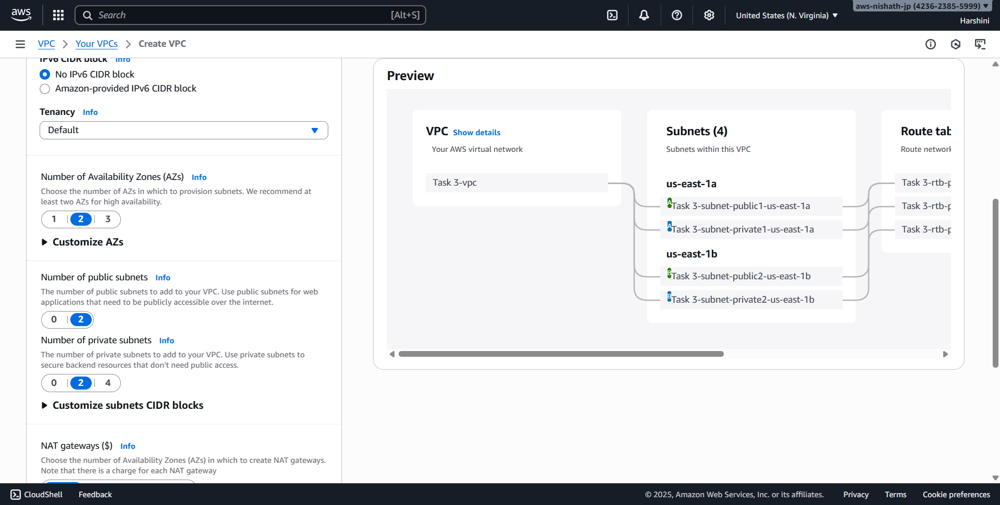
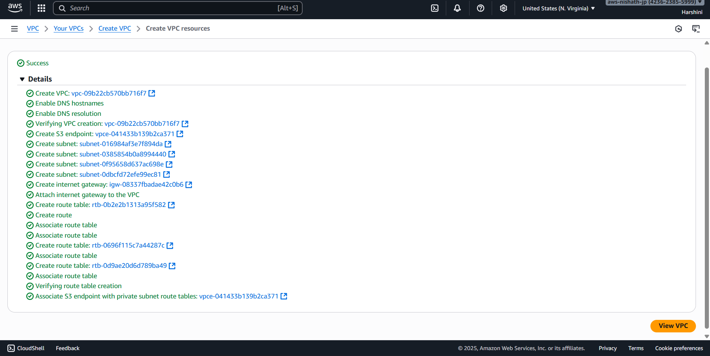

# Day 3 - Cloud Internship ElevateLabs

**Task 3: Create and Configure a Virtual Private Cloud (VPC) with Subnets**

🎯 Objective:

To learn how cloud networking works by creating a Virtual Private Cloud (VPC) with public and private subnets, and enabling controlled internet access.
This task teaches the backbone of secure cloud architecture and how resources are isolated and protected in the cloud.

- Created a new VPC named task 3

- With CIDR Range of 10.0.0.0/16
- create two new public and two private subnets in two AZ in us-east-1 region 

- Created one Internet gateway name project-igw
- And one route table for each public subnet 

