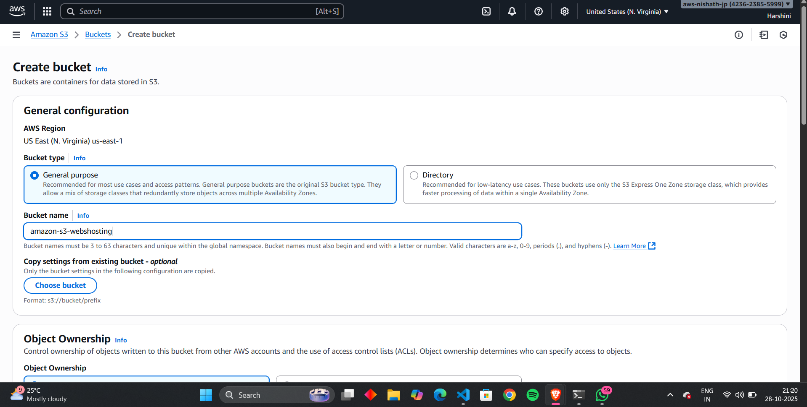
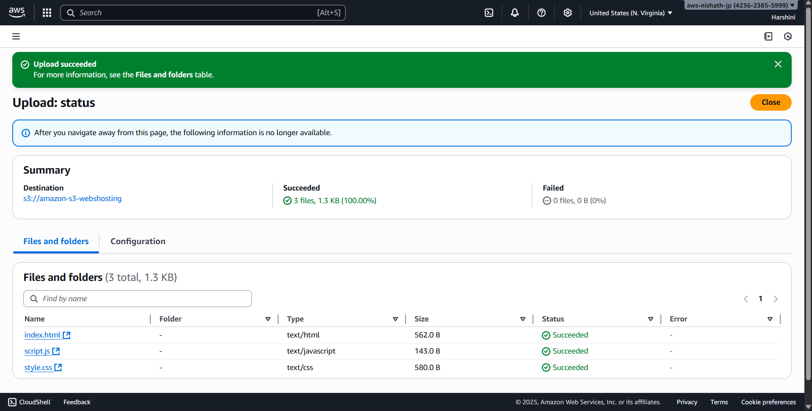
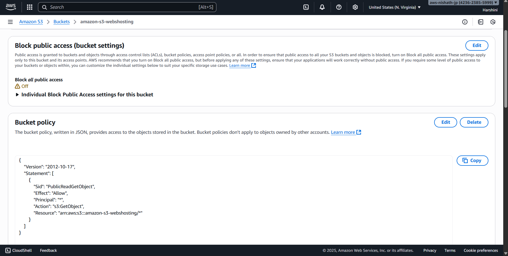
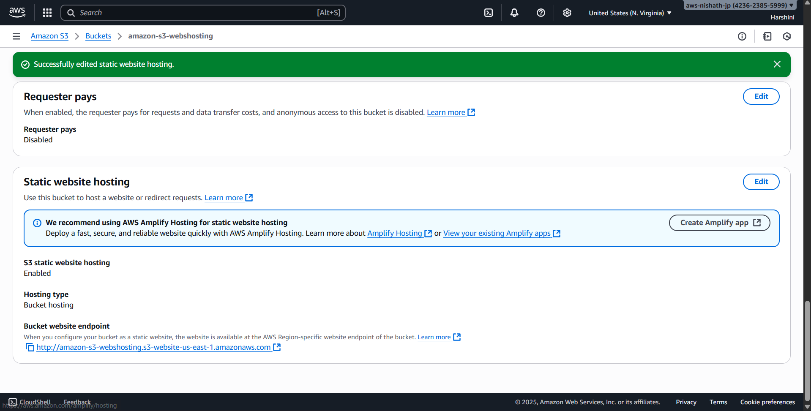
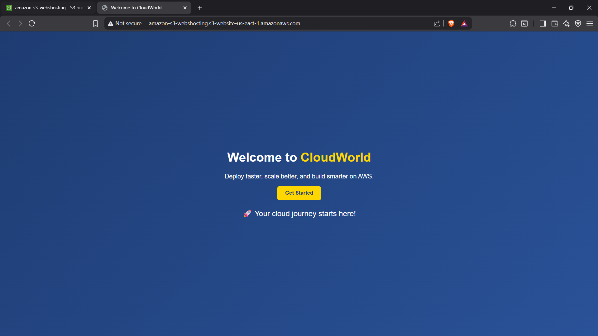

# Day 6 - Cloud Internship ElevateLabs

☁ **Task 6: Host and Deploy a Web Application on the Cloud**

---
🎯 **Objective:**

To deploy a *static or dynamic web application* (like a simple portfolio or basic HTML app) on a cloud platform using a *virtual machine, App Engine, or web hosting service*.

This helps interns understand *application deployment, public access, instance configuration, and domain management*.

.

## Images

### Created a new bucket named amazon-s3-webshosting

### Uploaded the Source code for my website which has html, css, js

### Disabled Block all public access and added a bucket policy

### Enabled Static website hosting  

### Working Webpage

## Source Code
The source code for Day 6 can be found in the [Source code](Source%20code) directory.

[Click here to view website](http://amazon-s3-webshosting.s3-website-us-east-1.amazonaws.com/)