# Day 8 - Cloud Internship ElevateLabs

☁ **Task 8: Deploy a Dockerized Web Application on the Cloud**

---
 🎯 **Objective:**

To understand *containerization* and *cloud-native deployment* by creating a *Docker image* of a simple web application and deploying it to a *cloud platform* (Google Cloud Run / AWS ECS / Azure Container Instances).

This teaches how modern applications are made portable, scalable, and easy to deploy.

## Images

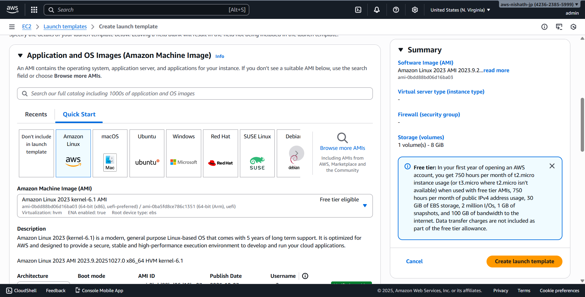

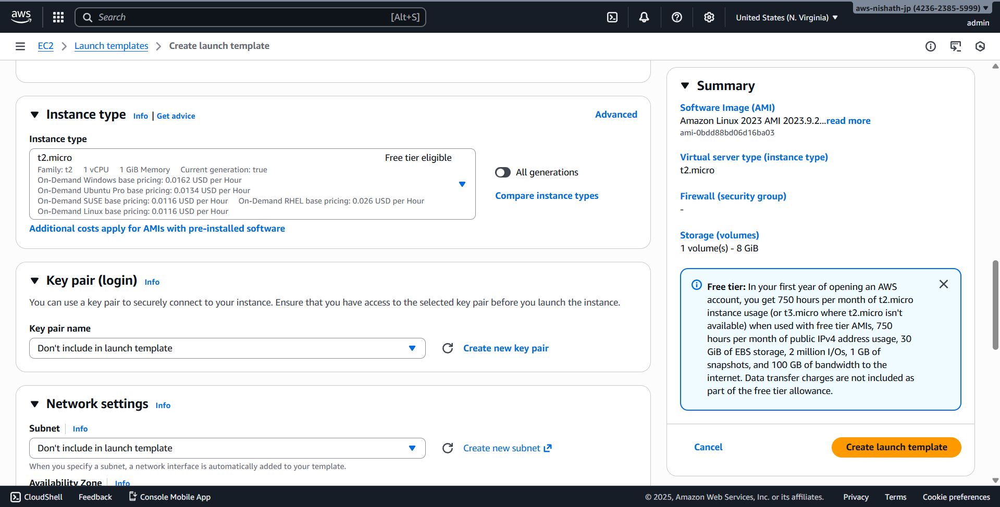

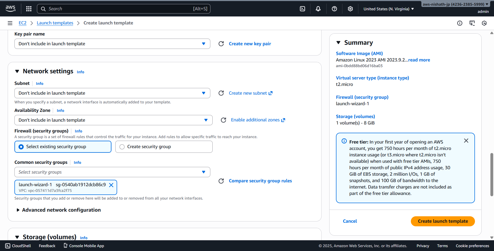

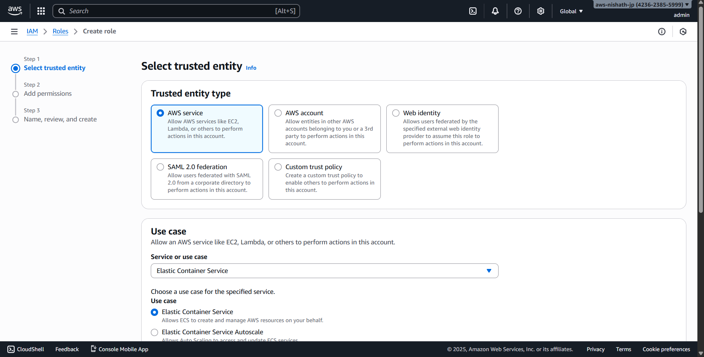

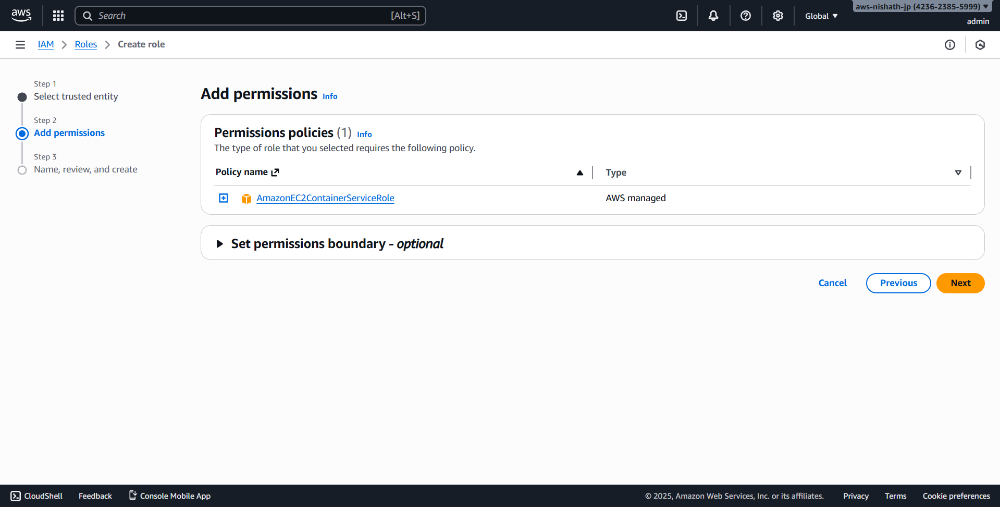

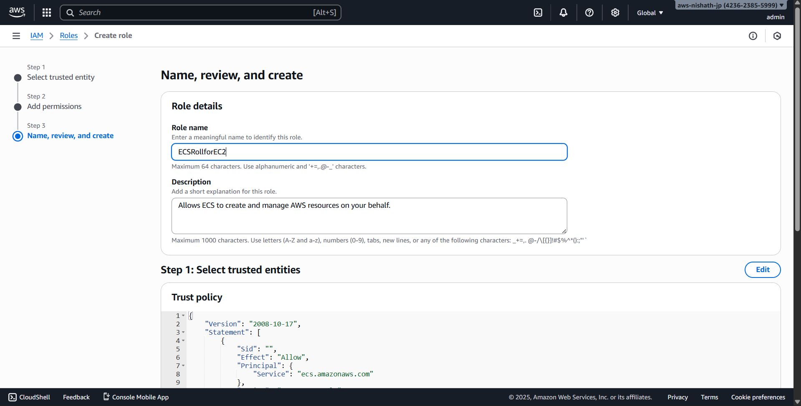

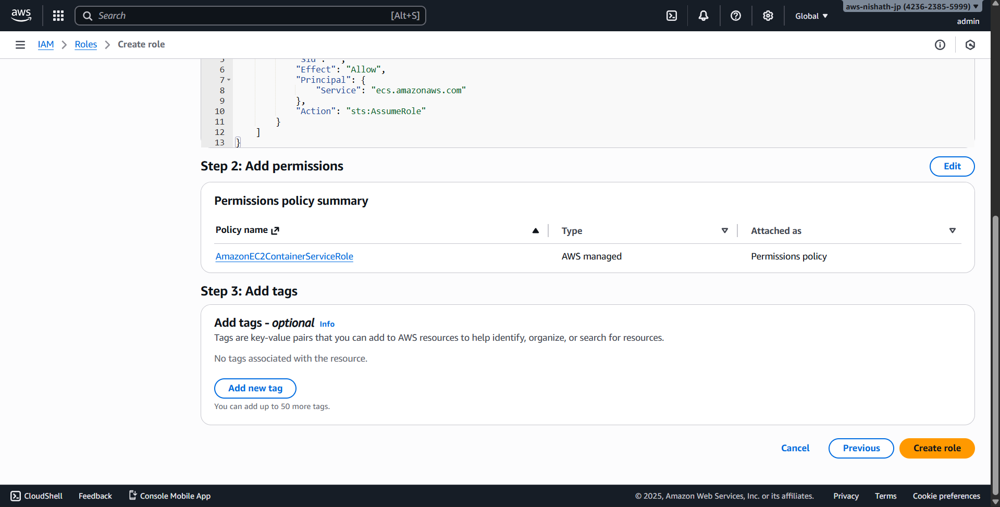

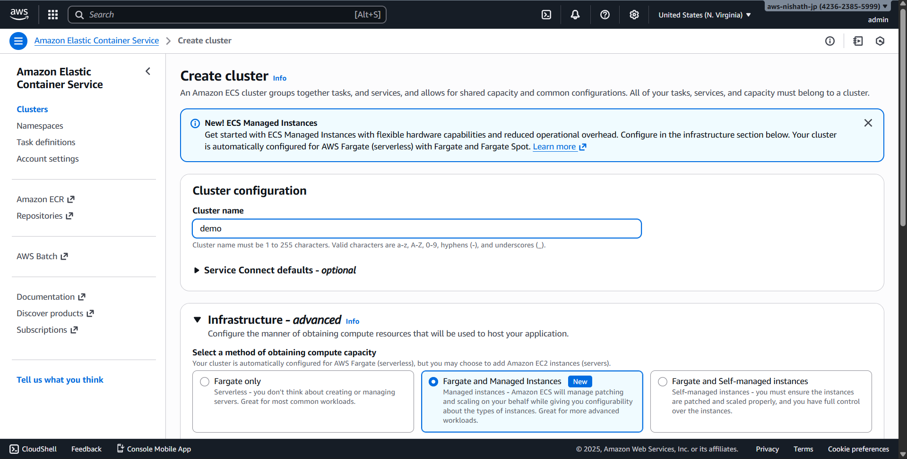

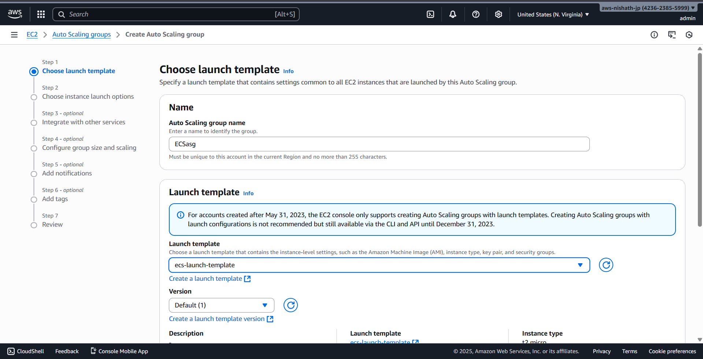

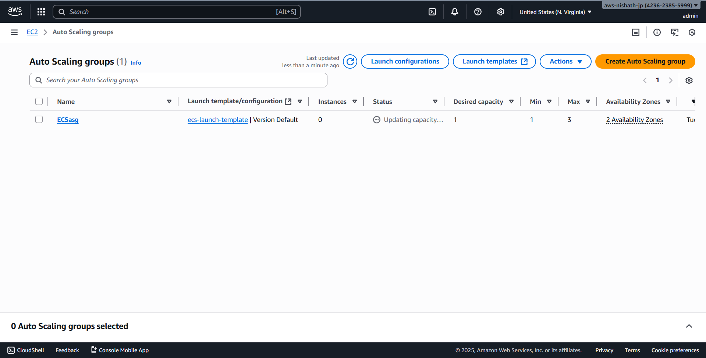

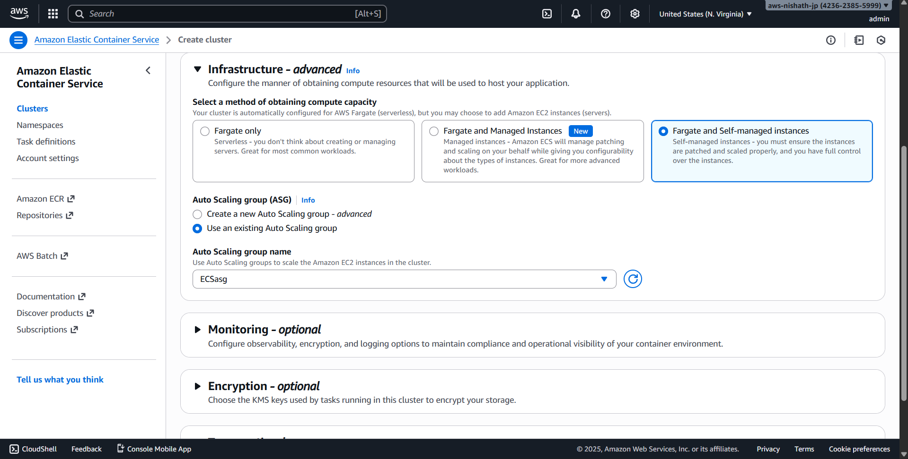

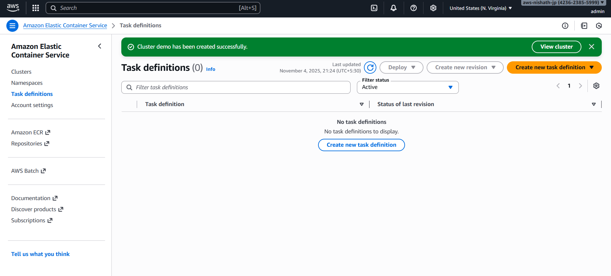

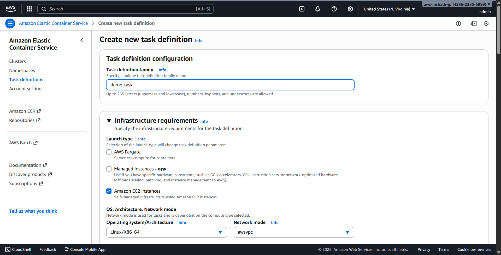

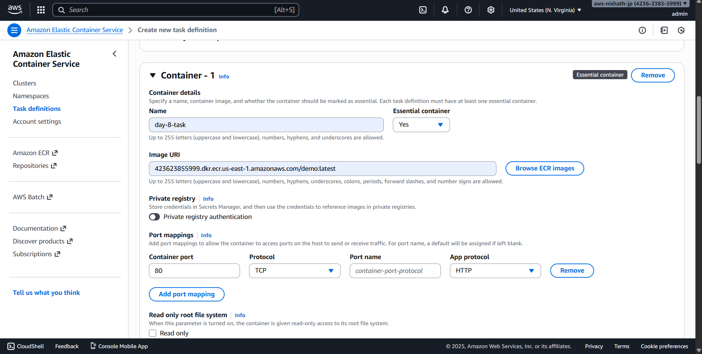

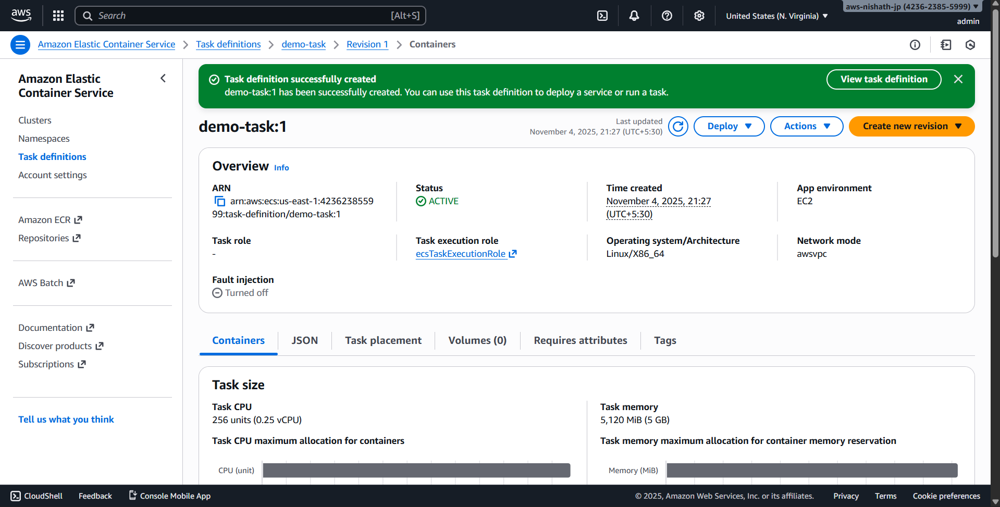

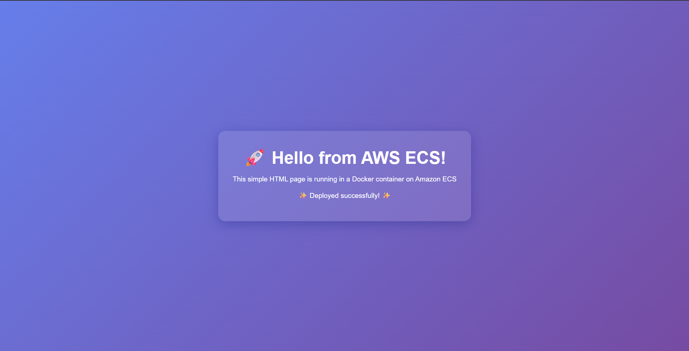

## Program Files
The program files for Day 8 can be found in the [Program](Program) directory.